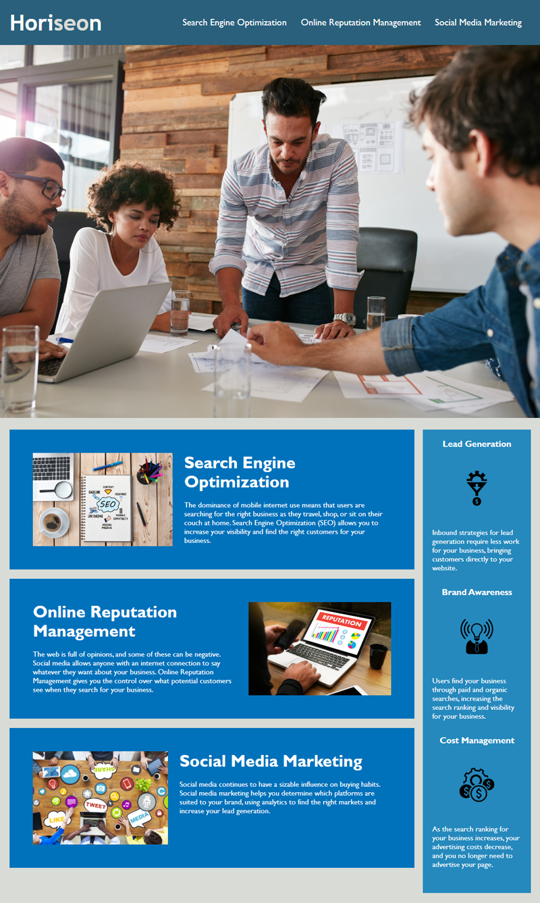

## Name
Code refactor of the Horiseon website

## Description
[Deployed Application](https://willmowlam.github.io/nebulus-horiseon-code-refactor/)

This repo is for the development of the Horiseon website template so it follows accessibility standards and is optimized for search engines.

## Visuals

## Authors and acknowledgment
 for accessibility refactoring work.

[Favicon.io](https://favicon.io/) for the favicons.

[Compressor.io](https://compressor.io/) for image compression.

## License
Copyright (c) Horiseon Social Solution Services, Inc. All rights reserved.

Licensed under the [MIT](LICENSE) license.
